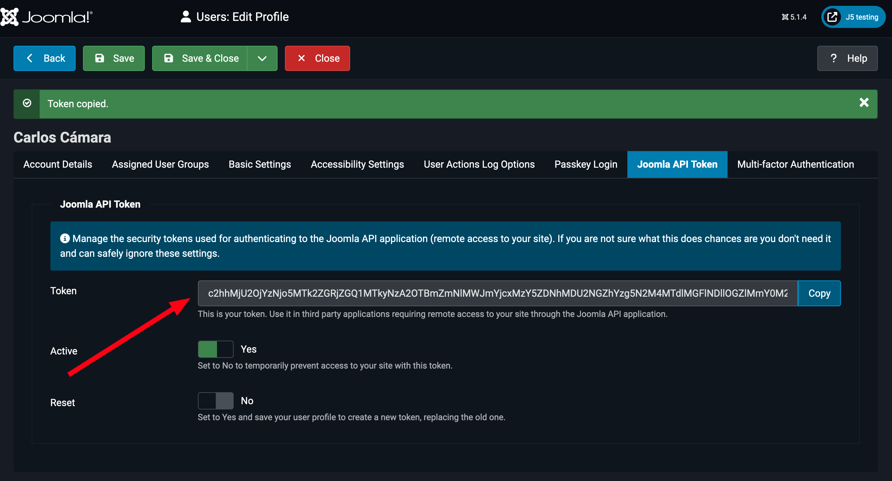

<!--
_class: cover
-->

# La puissance de Joomla ! 5 : Développez des services Web pour vos composants !

---

<!--
_header: "Qui je suis"
footer: '[Développer des extensions pour Joomla! 5](https://developingextensionsforjoomla5.com/jdayfr2024)'
-->

<div class="columns">
<div class="column column__content">

- Auteur de _Développer des extensions pour Joomla! 5_
- Obsédé par la productivité
- Actuellement Coordinateur des opérations chez Joomla!
- Passionné par Noël
- 3 enfants, 2 chiens, ~~1 chat~~ 2 chats et une épouse que j'adore

</div>
<div class="column">


## Carlos Cámara

</div>
</div>

---

<!--
_header: "Ce que nous allons voir"
-->

## Développez des services Web pour vos composants

1. Un composant bien défini pour Joomla! 5
2. Introduction aux services web
3. Routage de notre service web
4. Amusons-nous

---

<!--
_header: "Un composant bien défini pour Joomla! 5"
-->
<div class="columns">
<div class="column column__content">

- Tous les téléchargements pour ce workshop sont à l'adresse:

  https://developingextensionsforjoomla5.com/jdayfr2024

- Nous partons d'un composant bien défini suivant les standards Joomla! 5
- Vous pouvez vérifier comment nous avons construit ce composant dans d'autres versions de ce workshop à l'adresse:

  - https://developingextensionsforjoomla5.com/jdayes2024
  - https://developingextensionsforjoomla5.com/jdayusa2024

</div>
</div>

---

<!--
_header: "Introduction aux services web"
-->
<div class="columns">
<div class="column column__content">

- Un moyen de parler entre machines
- Sans HTML, répond en JSON, XML...
- Difficile à tester dans un navigateur
- 4 verbes: POST, GET, PATCH, DELETE
- Sans session utilisateur

</div>
<div class="column column__reference">

### Références


Chapitre 6

</div>
</div>

---

<!--
_header: "Utilisation des services web dans Joomla!"
-->
<div class="columns">
<div class="column column__content">

- POSTMAN, **HOPPSCOTCH**, PHP scripts, cURL, plugins de ton IDE...
- Tu as besoin de créer un token pour ton utilisateur Joomla dans tous les cas.

</div>
<div class="column column__reference">

### Références


Chapitre 6

</div>
</div>

---

<!--
_header: "Création du token API"
-->
<div class="columns">
<div class="column column__content">



</div>
<div class="column column__reference">

### Références


Chapitre 6

</div>
</div>
<!--
- Le token API est unique par utilisateur
- Pour un utilisateur nouvellement créé, il n'y a pas de token API. L'utilisateur doit enregistrer sa configuration pour le créer
- Seul l'utilisateur peut créer et voir son token API.
- Le token API n'est pas stocké dans la base de données.

---

<!--
_header: "Creando un point d'entrée pour notre service web"
-->
<div class="url">https://developingextensionsforjoomla5.com/jdayfr2024/live/webservices-plugin</div>

<div class="columns">
<div class="column column__content">

- Les routes sont ajoutées avec des plugins de type `webservices`.
- Nous allons développer le plugin et nous l'installerons avec la méthode **Découvrir** que nous avons utilisée avec le composant.

</div>
<div class="column column__reference">

### Références


Chapitre 6

</div>
</div>

---

<!--
_header: "Créer un plugin de service web"
-->
<div class="columns">
<div class="column column__content">

<!-- Start of Selection -->

Fichier de manifeste : `plugins/webservices/aiwfc/aiwfc.xml` :

<!-- End of Selection -->

```xml
<?xml version="1.0" encoding="UTF-8"?>
<extension type="plugin" group="webservices" method="upgrade">
    <name>plg_webservices_aiwfc</name>
    <author><![CDATA[Carlos Cámara]]></author>
    <authorEmail>carlos@hepta.es</authorEmail>
    <authorUrl>https://developingextensionsforjoomla5.com</authorUrl>
    <creationDate>2024-04-12</creationDate>
    <copyright>(C) 2024 Noel Enterprises</copyright>
    <license>GNU General Public License version 2 or later; see LICENSE.txt</license>
    <version>0.1.0</version>
    <description><![CDATA[Plugin pour router le service web de la liste de souhaits pour Joomla!]]></description>
    <namespace path="src">Noel\Plugin\WebServices\Aiwfc</namespace>
    <files>
        <folder plugin="aiwfc">services</folder>
        <folder>src</folder>
    </files>
</extension>
```

</div>
<div class="column column__reference">

<!-- Start of Selection -->

### Références

<!-- End of Selection -->


Chapitre 6

</div>
</div>

<!--
- Il est identique au manifeste du composant
- Nous nous assurons de l'inclure dans le dossier `webservices` dans le dossier `plugins`
-->

---

<!--
_header: "Créer un plugin de service web"
-->
<div class="columns">
<div class="column column__content reduced-code">

Fichier: `plugins/webservices/aiwfc/services/provider.php`:

```php
<?php

use Joomla\CMS\Extension\PluginInterface;
use Joomla\CMS\Factory;
use Joomla\CMS\Plugin\PluginHelper;
use Joomla\DI\Container;
use Joomla\DI\ServiceProviderInterface;
use Joomla\Event\DispatcherInterface;
use Noel\Plugin\WebServices\Aiwfc\Extension\Aiwfc;

return new class () implements ServiceProviderInterface {
    public function register(Container $container): void
    {
        $container->set(
            PluginInterface::class, function (Container $container) {
                $plugin     = new Aiwfc(
                    $container->get(DispatcherInterface::class),
                    (array) PluginHelper::getPlugin('webservices', 'aiwfc')
                );
                $plugin->setApplication(Factory::getApplication());
                return $plugin;
            }
        );
    }
};
```

</div>
<div class="column column__reference">

### Références


Chapitre 6

</div>
</div>

<!--
- Même structure que dans le composant
-->

---

<!--
_header: "Créer un plugin de service web"
-->
<div class="columns">
<div class="column column__content reduced-code">

Fichier: `plugins/webservices/aiwfc/src/Extension/Aiwfc.php`:

```php
<?php

namespace Noel\Plugin\WebServices\Aiwfc\Extension;

use Joomla\CMS\Plugin\CMSPlugin;
use Joomla\Router\Route;

\defined('_JEXEC') or die;

final class Aiwfc extends CMSPlugin
{
    public function onBeforeApiRoute(&$router)
    {
        $router->createCRUDRoutes(
            'v1/aiwfc/souhaits',
            'souhaits',
            ['component' => 'com_aiwfc']
        );
    }
}
```

</div>
<div class="column column__reference">

### Références


Chapitre 6

</div>
</div>
<!--
- Deux façons de créer les routes:
  1. avec la méthode `createCRUDRoutes()` qui ajoute toutes les actions possibles au service web.
  2. Avec la classe `Route` du Framework de Joomla! qui nous permet de détailler les actions à autoriser.
- Pour les entités individuelles, `createCRUDRoutes()` ajoute automatiquement le paramètre :id à la route que nous indiquons.
- Les paramètres sont: 
   - URL du service web
   - Contrôleur qui gérera la requête
   - Composant qui gérera la requête

-->

---

<!--
_header: "Gestion des requêtes dans notre composant"
-->
<div class="url">https://developingextensionsforjoomla5.com/jdayfr2024/live/api</div>

<div class="columns">
<div class="column column__content reduced-code">

Créer le fichier `api/src/Controller/SouhaitsController.php`

```php
<?php

namespace Noel\Component\Aiwfc\Api\Controller;

use Joomla\CMS\MVC\Controller\ApiController;

\defined('_JEXEC') or die;

class SouhaitsController extends ApiController
{
	protected $contentType = 'Souhaits';
	protected $default_view = 'Souhaits';
}

```

</div>
<div class="column column__reference">

### Références


Chapitre 6

</div>
</div>

<!--

- Nous étendons la classe `ApiController` de Joomla, ce qui nous permettra d'économiser beaucoup de code, car cette classe fournit déjà les méthodes de base comme `displayList()` et `add()`.

-->

---

<!--
_header: "Gestion des requêtes dans notre composant"
-->

<div class="columns">
<div class="column column__content reduced-code">

Créer le fichier `api/components/com_aiwfc/src/View/Souhaits/JsonapiView.php`

```php
<?php
namespace Noel\Component\Aiwfc\Api\View\Souhaits;
use Joomla\CMS\MVC\View\JsonApiView as BaseApiView;

class JsonapiView extends BaseApiView
{
        protected $fieldsToRenderList = [
                'id', 'titre',
                'description', 'cree_le'
        ];

        protected $fieldsToRenderItem = [
                'id', 'titre',
                'description'
        ];
}

```

</div>
<div class="column column__reference">

### Références


Chapitre 6

</div>
</div>

<!--

- Nous incluons la classe `JsonapiView` qui étend la classe `JsonApiView` de Joomla. Dans ce fichier, nous définissons les champs que nous souhaitons afficher dans la liste et dans l'élément.

-->

---

<!--
_header: "Sur les épaules de géants"
-->

- Livre en ligne _Joomla Extension Development_ par Nicholas Dionysopoulos
  - https://www.dionysopoulos.me/book.html
- Livre d'Astrid: _Joomla 4 – Developing Extensions: Step by step to an working Joomla extension_

  - https://web.archive.org/web/20230518080457/https://blog.astrid-guenther.de/en/der-weg-zu-joomla4-erweiterungen/

- Documentation Joomla! pour les programmeurs

  - https://manual.joomla.org

  <!-- Si j'ai vu plus loin que d'autres hommes, c'est parce que j'étais sur les épaules de géants. -->

---

<!--
_class: Merci beaucoup
footer: ''
-->

<div class="text-huge">
    Merci!
</div>
